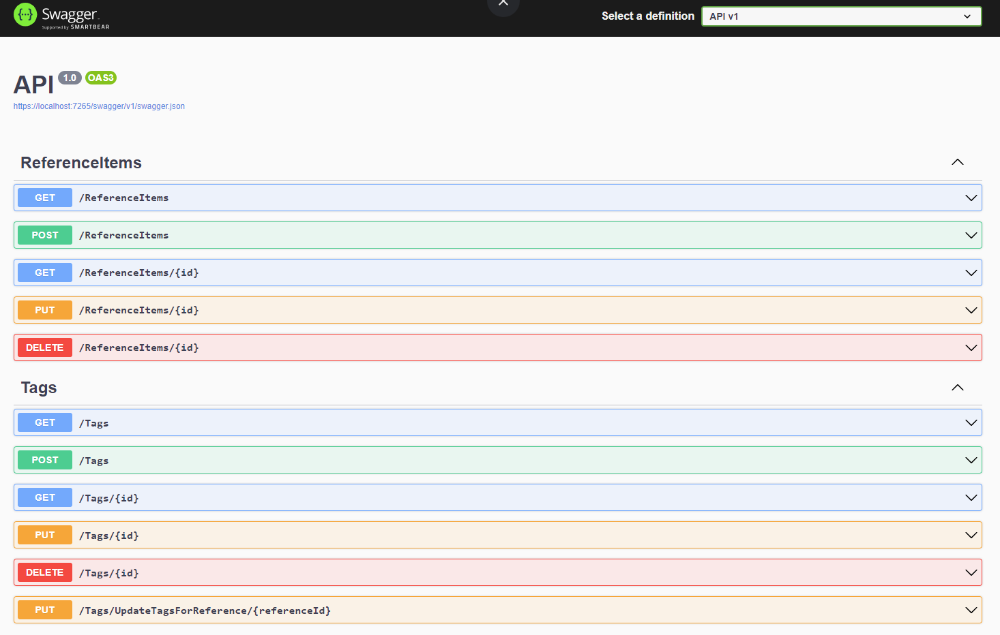

# WonderLynx

WonderLynx is a straightforward CRUD application built with .NET 8.0 and C# 12. The main goal of this project is to increase knowledge of the technologies used in production environments as well as best practices for writing code. 


## Current Features

- **REST API**: A well-structured API for managing reference items, categories, tags, and types.
- **Swagger Integration**: The API is fully documented using Swagger, providing an accessible interface for developers to interact with the endpoints.
- **Dependency Injection (DI)**: Extensively utilized to ensure loose coupling and ease of testing.
- **SOLID Principles**: The project adheres to SOLID principles to maintain clean, scalable, and maintainable code.
- **Clean Code**: Emphasis on writing clear, understandable, and maintainable code.

## Usage

### Voraussetzungen

- **SQL Server Management Studio (SSMS)**: Zum Verwalten der Datenbank.
- **Visual Studio 2022**: Für die Entwicklung und Ausführung des Projekts.
- **.NET 8.0 SDK**: Muss installiert sein, um das Projekt auszuführen.

### Schritt 1: Datenbank einrichten

1. **Datenbank erstellen**:
   - Öffne SQL Server Management Studio (SSMS).
   - Verbinde dich mit deinem SQL Server.
   - Erstelle eine neue Datenbank mit dem SQL-Skript:
   
```sql
   CREATE DATABASE WonderLynx;

   USE WonderLynx;

   CREATE TABLE Categories (
       CategoryId INT PRIMARY KEY IDENTITY,
       Name NVARCHAR(100) NOT NULL
   );

   CREATE TABLE Tags (
       TagId INT PRIMARY KEY IDENTITY,
       Name NVARCHAR(100) NOT NULL
   );

   CREATE TABLE Types (
       TypeId INT PRIMARY KEY IDENTITY,
       Name NVARCHAR(100) NOT NULL
   );

   CREATE TABLE ReferenceItems (
       ReferenceId INT PRIMARY KEY IDENTITY,
       Title NVARCHAR(200) NOT NULL,
       Subtitle NVARCHAR(200) NULL,
       TypeId INT FOREIGN KEY REFERENCES Types(TypeId),
       CategoryId INT FOREIGN KEY REFERENCES Categories(CategoryId),
       Description NVARCHAR(MAX) NULL,
       ThumbnailUrl NVARCHAR(200) NULL
   );

   CREATE TABLE ReferenceTags (
       ReferenceId INT FOREIGN KEY REFERENCES ReferenceItems(ReferenceId),
       TagId INT FOREIGN KEY REFERENCES Tags(TagId),
       PRIMARY KEY (ReferenceId, TagId)
   );
```

2. **Datenbankverbindung konfigurieren**:
   - Öffne das Projekt in Visual Studio.
   - Bearbeite die `appsettings.json`-Datei im `API`-Projekt, um die Verbindungszeichenfolge zur Datenbank zu konfigurieren:

   ```json
   "ConnectionStrings": {
       "DefaultConnection": "Server=your_server_name;Database=WonderLynx;Trusted_Connection=True;"
   }
   ```

### Schritt 2: Projekt ausführen

1. **Abhängigkeiten wiederherstellen**:
   - Öffne das `API`-Projekt in Visual Studio.
   - Stelle sicher, dass alle notwendigen Pakete installiert sind, indem du `dotnet restore` ausführst oder das Projekt einfach in Visual Studio baust.

2. **Migrationen anwenden** (falls erforderlich):
   - Öffne die Package Manager Console in Visual Studio.
   - Führe `Update-Database` aus, um alle Migrationen anzuwenden.

3. **Projekt starten**:
   - Drücke `F5` oder klicke auf `Start`, um die Anwendung auszuführen.
   - Die Anwendung wird gestartet und ist unter `https://localhost:7265` verfügbar.

### Schritt 3: API verwenden

Verwende Swagger UI, um die verfügbaren API-Endpunkte zu durchsuchen und zu testen:



3. **Authentifizierung und Autorisierung**:
   - Falls benötigt, implementiere und konfiguriere die Authentifizierung (z.B. JWT oder OAuth).

## TO DO:

The project is in a stable state, but there are several opportunities for enhancement and expansion:

1. **Containerization**:
   - Dockerize the application to facilitate consistent and portable deployments across various environments.

2. **Deployment**:
   - Deploy the application and its database to Azure Cloud for scalability and improved reliability.
   - Implement Azure DevOps pipelines to automate Continuous Integration and Continuous Deployment (CI/CD).

3. **Testing**:
   - Develop comprehensive Unit and Integration Tests to ensure robustness and reliability of the application.

4. **Microservices**:
   - Explore the implementation of microservices for tasks such as file processing and image compression, allowing for better scalability and separation of concerns.

5. **Best Practices**:
   - Continue to apply and refine software development best practices, including DRY (Don’t Repeat Yourself), KISS (Keep It Simple, Stupid), and OWASP security guidelines.

## Contributing

Contributions are welcome. Please feel free to fork the repository, create a feature branch, and submit a pull request.

## License

This project is licensed under the MIT License.
